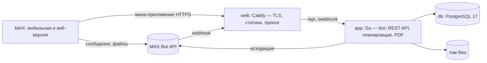

# Приёмка — рабочее место председателя совета МКД в MAX

Чат-бот [`t84_hakaton_max_bot`](https://max.ru/t84_hakaton_max_bot) и мини-приложение, с которыми председатель совета многоквартирного дома принимает акты работ управляющей компании по порядку, утверждённому приказом Минстроя России от 22.05.2026 № 318/пр (действует с 01.09.2026).

Трек «Умный город»

Прод: мини-приложение <https://max-hackathon-84.ru>, собственный API `https://max-hackathon-84.ru/api/v1` (контракт — `api/openapi.yaml`, проверки — `DATA-API.yaml`), проверка здоровья <https://max-hackathon-84.ru/healthz>.

## Назначение

С 01.09.2026 председатель совета дома в течение 10 дней со дня получения акта от УК должен вернуть подписанный экземпляр или направить обоснованный отказ. Если за 30 дней исполнитель не получит ни того, ни другого, акт считается оформленным со стороны совета. Графы «подписано с замечаниями» в форме акта (приказ № 761/пр) нет: акт либо подписывают, либо от подписания отказываются.

С «Приёмкой» председатель:
- видит оба срока и получает напоминания о них;
- узнаёт, соблюдала ли сроки сама УК;
- проверяет акт по строкам и собирает подтверждения жильцов;
- получает готовый PDF — сопроводительное письмо к подписанному акту или мотивированный отказ с возражениями по строкам и перечнем доказательств;
- после отказа принимает новый акт от УК, в котором уже отмечены строки, оспоренные в прошлый раз.

## Основной пользовательский сценарий

1. **Бот.** Председатель соглашается на обработку данных и заполняет профиль: ФИО, квартира, основание полномочий, адрес дома, УК, договор. Затем присылает акт, полученный от УК, — фото или PDF — и отвечает, когда и как его получил и пришли ли два экземпляра с подписью УК.
2. **Бот.** Считает 10-й день (срок ответа) и 30-й день (после него акт считается оформленным) и присылает сводку. Проверяет сроки самой УК: акт оформлен не позже 30 дней после оказания услуг и не позже окончания договора, направлен не позже 5 дней после оформления, в двух подписанных экземплярах. Для проверки оформления нужны дата акта и период — их председатель вносит в мини-приложении.
3. **Мини-приложение.** Председатель переносит в карточку реквизиты акта по форме 761/пр и его строки; наименования работ подсказываются из перечня ПП № 290. По каждой строке ставит оценку «подтверждено», «под сомнением» или «не выполнено», пишет возражение и прикладывает фото. Сервис считает сумму спора и сверяет сумму строк с итогом акта.
4. **Жильцы.** Председатель пересылает в чат дома текстовую ссылку `https://max.ru/t84_hakaton_max_bot?startapp=inv_…`. Жилец выбирает подъезд и по каждой строке отвечает «было», «не было» или «не знаю». Председатель видит только число ответов и комментарии, без имён.
5. **Документ.** «Подписать» или «Отказаться от подписания» в мини-приложении формирует PDF. Бот присылает его файлом в чат; в мини-приложении его можно скачать.
6. **Отправка.** Председатель сам передаёт документ в УК и отмечает в боте способ и дату. После отказа УК оформляет новый акт; председатель присылает его боту кнопкой «Получил новый акт», строки копируются из прежнего, ранее оспоренные помечены. Если отправка не отмечена до конца 30-го дня, акт получает статус «принят молчанием».

Команды бота: `/start`, `/menu` — текущий акт и меню, `/profile` — посмотреть и изменить профиль, `/help`, `/demo` — перемотка времени демо-акта, `/delete` — удалить свои данные.

## Состав и архитектура



| Компонент | Технологии | Роль |
|---|---|---|
| `backend/` → контейнер `app` | Go 1.26, официальная библиотека MAX Bot API, pgx, goose, maroto (PDF) | Бот (вебхук или long polling), REST API `/api/v1`, планировщик напоминаний (раз в минуту), генерация PDF |
| `webapp/` → контейнер `web` | React 19, TypeScript, Vite, MAX UI, MAX Bridge; Caddy 2 | Мини-приложение; Caddy отдаёт статику, проксирует `/api` и `/webhook`, в проде получает сертификат Let's Encrypt |
| `db` | PostgreSQL 17 | Пользователи, дома, акты, строки, доказательства, ответы жильцов, документы, напоминания, история |
| `config/` | YAML, JSON | Правила приёмки с источниками, тексты сообщений и документов, справочник ПП № 290, демо-данные |
| `api/openapi.yaml` | OpenAPI 3.1 | Контракт API; из него генерируются TS-типы фронта (`npm run gen:api`) |

Пакеты бэкенда:

| Пакет | Что делает |
|---|---|
| `internal/domain` | Сроки, проверки УК, суммы, статусы акта — чистые функции с тестами |
| `internal/rules` | Загрузка правил, источников и текстов из `config/` |
| `internal/app` | Сценарии, общие для бота, API и планировщика; планировщик — `scheduler.go` |
| `internal/bot`, `internal/api`, `internal/maxbot` | Диалог в боте, HTTP API, клиент MAX |
| `internal/store`, `internal/files`, `internal/pdf` | SQL, хранение файлов и подписанные ссылки, вёрстка документов |
| `internal/civil`, `internal/apicheck` | Календарные даты; прогон проверок из `DATA-API.yaml` |

Сроки (10, 30, 30 и 5 дней, два экземпляра), способ счёта дней и график напоминаний заданы в `config/rules/acceptance.yaml`, а не в коде. У каждого правила указаны источник, редакция, дата сверки и тип: норма, расчёт сервиса, рекомендация или допущение. В интерфейсе эти сведения открываются по ссылке «Основание ›» у каждого срока и каждой проверки.

## Запуск одной командой

```bash
docker compose up --build
```

После запуска:
- мини-приложение в браузере: <http://localhost:8080/?dev_user=1> (без `?dev_user=` оно просит открыть его из MAX);
- API: `http://localhost:8080/api/v1`, вход заголовком `X-Dev-User: <число>`;
- проверка здоровья: <http://localhost:8080/healthz>.

По умолчанию бот выключен (`BOT_MODE=off`). Чтобы проверить бота локально, положите токен в `.env` и запустите `BOT_MODE=polling docker compose up --build`. Если у бота уже зарегистрирован вебхук (работает прод), polling не стартует: иначе он снял бы вебхук и отключил прод-бота. Для локальной проверки нужен отдельный токен; снять вебхук осознанно можно через `POLLING_TAKEOVER=true`.

### Необходимые параметры окружения

- Docker Engine 24+ с плагином Docker Compose v2, доступ в интернет для загрузки образов и зависимостей.
- Свободные порты 8080 и 8443 (меняются через `HTTP_PORT`, `HTTPS_PORT`).
- Сборка с пустым кэшем занимает от одной до пяти минут в зависимости от канала: компиляция и сборка фронта идут меньше минуты, остальное — загрузка Go-модулей и npm-пакетов (около 300 МБ).
- Если хост выходит в интернет через VPN с MTU меньше 1500 и запросы к MAX из контейнера зависают, задайте `DOCKER_MTU` (например, 1376) в `.env`. На сборку эта переменная не влияет: если зависает `go mod download` или `npm ci`, пропишите `"mtu": 1376` в `/etc/docker/daemon.json` или соберите образы с сетью хоста (`docker build --network host -f backend/Dockerfile -t priemka-app .`, затем `docker compose up -d --no-build`).

### Переменные окружения

Все переменные с комментариями перечислены в `.env.example`. Секретов в репозитории нет. Значения по умолчанию подставляет `compose.yaml`.

| Переменная | По умолчанию | Назначение |
|---|---|---|
| `MAX_BOT_TOKEN` | — | Токен бота: нужен боту и для проверки подписи initData |
| `BOT_MODE` | `off` | `off`, `polling` (только локально) или `webhook` (прод) |
| `POLLING_TAKEOVER` | `false` | Разрешить polling снять зарегистрированный вебхук (отключит прод-бота) |
| `BOT_USERNAME` | `t84_hakaton_max_bot` | Ник бота для ссылок; при подключённом боте берётся из MAX |
| `PUBLIC_URL`, `WEBHOOK_SECRET` | — | Прод: адрес `https://домен` и секрет вебхука |
| `SITE_ADDRESS` | `:80` | Прод: домен, для которого Caddy получит сертификат Let's Encrypt |
| `HTTP_PORT`, `HTTPS_PORT` | `8080`, `8443` | Публикуемые порты; в проде `80` и `443` |
| `POSTGRES_PASSWORD` | `priemka` | Пароль БД |
| `FILES_SECRET` | локальное значение | Ключ подписи ссылок на файлы; в проде — случайная строка |
| `DEMO_MODE` | `true` | Демо-профиль, демо-акт, перемотка времени демо-актов |
| `DEV_AUTH` | `true` | Вход в API заголовком `X-Dev-User` без MAX; с `BOT_MODE=webhook` сервис не стартует |
| `TEST_ACCOUNTS` | — | Тестовые учётки API: `chairman:<токен>,resident:<токен>` |
| `INIT_DATA_TTL` | `24h` | Срок годности initData |
| `LOG_LEVEL`, `DOCKER_MTU` | `info`, `1500` | Уровень логов; MTU docker-сети |

В режиме `webhook` сервис не стартует с локальными значениями `POSTGRES_PASSWORD` и `FILES_SECRET`.

Для запуска бэкенда без Docker дополнительно нужны `DATABASE_URL`, `CONFIG_DIR`, `FONTS_DIR`, `FILES_DIR`, `HTTP_ADDR` (в образе — `/app/config`, `/app/assets/fonts`, `/data/files`, `:8080`) и `EXTRA_CA_FILE` — путь к `certs/rootca_ssl_rsa2022.crt`. Без compose `DEMO_MODE` и `DEV_AUTH` выключены.

### Используемые порты

| Порт | Где | Что |
|---|---|---|
| 8080 → 80 | `web` | HTTP: мини-приложение, `/api`, `/webhook`, `/healthz` |
| 8443 → 443 (TCP и UDP) | `web` | HTTPS и HTTP/3 (в проде, когда `SITE_ADDRESS` — домен) |
| 8080 (внутренний) | `app` | Бэкенд, доступен только из сети compose |
| 5432 (внутренний) | `db` | PostgreSQL, наружу не публикуется |

### Зависимости

Версии зафиксированы в `backend/go.mod` и `backend/go.sum`, `webapp/package.json` (точные версии) и `webapp/package-lock.json`. Сборочные образы зафиксированы до патча (`golang:1.26.8-alpine`, `node:24.21.0-alpine`), рабочие — до минорной версии, чтобы получать исправления безопасности (`alpine:3.22`, `caddy:2.11-alpine`), PostgreSQL — до мажорной (`postgres:17-alpine`).

Все библиотеки — со свободными лицензиями:

| Библиотека | Лицензия |
|---|---|
| max-bot-api-client-go (официальная библиотека MAX) | Apache-2.0 |
| @maxhub/max-ui | MIT |
| pgx, goose, maroto, phpdave11/gofpdf | MIT |
| pdfcpu (зависимость maroto) | Apache-2.0 |
| go.yaml.in/yaml/v3 | MIT и Apache-2.0 |
| kin-openapi (только в тестах) | MIT |
| React, Vite, openapi-typescript | MIT |
| TypeScript | Apache-2.0 |
| lightningcss (сборка CSS, в образ не попадает) | MPL-2.0 |
| Шрифт PT Serif (ParaType) | SIL OFL 1.1 (`assets/fonts/OFL.txt`) |

## Внешние сервисы и интеграции

| Сервис | Зачем | Можно ли воспроизвести в Docker |
|---|---|---|
| MAX Bot API (`platform-api2.max.ru`) | Сообщения, кнопки, приём файлов, отправка PDF, вебхук | Нет. Нужен токен бота; локально бот работает через long polling |
| MAX Bridge (`st.max.ru/js/max-web-app.js`) | initData, параметр `startapp`, `downloadFile`, `BackButton` | Нет. Внутри MAX мини-приложение открывается только по публичному HTTPS-адресу; локально — в браузере с `?dev_user=` |
| Let's Encrypt | Сертификат для мини-приложения и вебхука | Используется только в проде |

Сертификат `platform-api2.max.ru` выдан удостоверяющим центром Минцифры (Russian Trusted Sub CA), поэтому в образ `app` добавлен корневой сертификат Минцифры `certs/rootca_ssl_rsa2022.crt`. Проверка TLS не отключена.

Интеграций с ГИС ЖКХ, ГАР/ФИАС и электронной подписью нет, их имитаций тоже нет: все данные вводит пользователь, подготовленные данные перечислены ниже. Что понадобится для этих интеграций после MVP:

| Интеграция | Что даст | Что нужно |
|---|---|---|
| ГИС ЖКХ | Акты и договор управления подгружаются без ручного ввода | Доступ к API ГИС ЖКХ есть только у поставщиков информации — нужна организация-партнёр (УК, ТСН) или оператор, работающий от её имени |
| Электронная подпись | Юридически значимое подписание и отправка отказа без бумаги | Подключение к сервису ЭП и согласие исполнителя на электронный документооборот |
| Распознавание актов | Строки акта из фото или PDF | Локальная модель распознавания таблиц или внешний сервис с согласием пользователя на передачу акта |
| ГАР/ФИАС | Проверенный адрес дома | Выгрузка или API ФНС по адресному реестру |

## Работа с данными

- **Что храним:** имя пользователя в MAX; профиль председателя (ФИО, квартира, основание полномочий); дом и договор; акты, строки и оценки; файлы (исходный акт, фото, сформированные PDF); ответы жильцов (подъезд, ответ, комментарий); историю событий по акту. Телефон и геолокацию не запрашиваем.
- **Где:** PostgreSQL (том `db-data`) и файлы на томе `files`. Файлы выдаются только по подписанной ссылке, которая действует 30 минут.
- **Кто видит:** акт виден только председателю его дома, это проверяется на каждом запросе. Жилец видит строки без цен и только свои ответы. Председатель видит ответы жильцов в виде чисел и комментариев, без имён; в документ попадает только число ответивших.
- **Согласие:** председатель даёт его в боте при первом запуске, жилец — в мини-приложении перед отправкой ответов.
- **Удаление:** `/delete` удаляет все данные пользователя. Отдельный акт удаляется кнопкой «🗑 Удалить акт» в боте или в карточке мини-приложения вместе со строками, фото, документами и ответами жильцов. Демо-акт можно удалить всегда, настоящий — пока документ по нему не отмечен отправленным в УК: после отправки акт хранится как история переписки с исполнителем.
- **Вход:** мини-приложение передаёт `window.WebApp.initData`; сервер проверяет подпись (HMAC-SHA256, ключ от токена бота) и срок `auth_date`.

## Тестовые и подготовленные данные

| Данные | Откуда | Пометка |
|---|---|---|
| Справочник работ `config/catalog/pp290.json` (147 позиций) | Текст ПП РФ от 03.04.2013 № 290 в ред. от 07.03.2025 № 293, разобран автоматически | Источник и редакция указаны в файле и в подсказках |
| Демо-профиль, дом, УК, договор и акт с 8 строками (`config/demo/demo-act.json`) | Синтетические: «г. Демоград, ул. Тестовая, д. 1», «ООО «УК Пример» (вымышленная организация)», цены вымышлены | Метка «ДЕМО» в интерфейсе, водяной знак «ДЕМО — синтетические данные» в PDF |
| `demo/act-demo.pdf` | Синтетический акт по форме 761/пр, сформирован `go run ./cmd/demoact`; его можно прислать боту как акт от УК | Водяной знак |
| Правила сроков | Приказы № 318/пр и № 761/пр; спорные трактовки помечены как допущения | Метки «Норма», «Расчёт», «Рекомендация», «Допущение» |

Демо-режим (`DEMO_MODE=true`) даёт:
- кнопки «🧪 Заполнить демо-профилем» и «🧪 Взять демо-акт» в боте и «🧪 Создать демо-акт» в мини-приложении;
- перемотку времени демо-акта: `/demo` в боте или карточка «Демо-режим» в мини-приложении. Сдвиг хранится у конкретного акта и не влияет на другие акты и других пользователей.

Пока профиль демо, акты, присланные файлом, тоже получают метку «ДЕМО»: их шапка (адрес, УК, договор) берётся из вымышленного профиля. Чтобы работать с настоящим актом, заполните профиль своими данными (`/profile` → «Изменить»).

Тестовые учётки собственного API (`TEST_ACCOUNTS`): при старте создаются председатель с демо-домом, демо-актом «на проверке» и приглашением, а также жилец. Запросы от их имени — с заголовком `Authorization: Bearer <токен>`; токены приведены на первом слайде презентации. Если демо-акт председателя уходит в финальный статус (например, через 30 дней становится «принят молчанием»), планировщик создаёт новый, поэтому проверки можно повторять весь период проверки. Проверки описаны в `DATA-API.yaml`; прогон — `scripts/check-api.sh <base_url> <токен chairman> <токен resident>` (нужен Go): скрипт читает `DATA-API.yaml` и сверяет код ответа, `Content-Type` и обязательные поля.

## Пошаговый сценарий проверки (≈ 10 минут)

| # | Действие | Ожидаемый результат |
|---|---|---|
| 1 | Открыть <https://max.ru/t84_hakaton_max_bot>, нажать «Начать» | Приветствие, кнопка «✅ Согласен на обработку данных» |
| 2 | «Согласен» → «🧪 Заполнить демо-профилем» | «Профиль заполнен синтетическими данными (ДЕМО)…», меню |
| 3 | «🧪 Взять демо-акт» | «🧪 Создан демо-акт № 17 с 8 строками…» и вопрос «Когда вы получили акт?» |
| 4 | «Сегодня» → «Лично» → «Да, два подписанных» | Сводка: срок ответа (10-й день), 30-й день, основание, проверка сроков УК («⚠️ Акт получен через 8 дн. после оформления…»), кнопки «🔍 Открыть проверку», «👥 Пригласить жильцов», «🧪 Демо: перемотать время» |
| 5 | «🔍 Открыть проверку» | Мини-приложение на карточке этого акта: сроки со ссылкой «Основание ›», проверки УК, итоги, 8 строк |
| 6 | Строка 6 «Очистка кровли…» → «Не выполнено», возражение → «Сохранить комментарий»; строка 2 «Мытьё окон…» → «Под сомнением», «📷 Добавить фото или PDF» | Уведомления «Сохранено», «Доказательство добавлено»; в итогах «Оспаривается: 14 100,00 ₽ (2 строки)». Повторное нажатие на выбранную оценку снимает её |
| 7 | «Добавить строку», ввести «уборк» | Подсказки из ПП № 290 с номерами пунктов |
| 8 | В боте «👥 Пригласить жильцов» | Два сообщения: пояснение и готовый текст со ссылкой `…?startapp=inv_…` для пересылки |
| 9 | Открыть ссылку (другим аккаунтом или своим) | Экран жильца: подъезды 1–4, строки без цен, «Было / Не было / Не знаю», согласие → «Спасибо! Ответ учтён» |
| 10 | Вернуться в карточку акта | У строк «👥 было N / не было M», «Ответили: N» |
| 11 | Карточка «Демо-режим» → «К 9-му дню» | «Сейчас 9-й день после получения»; в течение минуты бот пишет «⚠️ Акт № 17: завтра, …, последний день для ответа исполнителю…» |
| 12 | «Отказаться от подписания» → «Сформировать PDF» | «Документ готов и отправлен вам в чат с ботом». В чате — PDF с таблицей возражений, суммой спора, перечнем доказательств Д-1… и водяным знаком «ДЕМО» |
| 13 | В сообщении с PDF «📮 Отметить отправку в УК» → «Лично» → «Сегодня» | «Отмечено: документ направлен лично…», кнопка «📄 Получил новый акт» |
| 14 | «📄 Получил новый акт» → прислать `demo/act-demo.pdf` или любое фото → «Сегодня» | Новый акт; строки скопированы, ранее оспоренные помечены «оспаривалась ранее» |
| 15 | Для нового акта «К 31-му дню» | Бот: «Прошло 30 дней… Акт считается оформленным со стороны совета»; статус «Принят молчанием», правки заблокированы |
| 16 | Ошибки: текст вместо даты получения; файл больше 20 МБ; отказ без возражений | «Не понял дату…»; «Файл больше 20 МБ…»; «Для отказа нужна хотя бы одна строка…» — работу можно продолжить без перезапуска |

Сценарий проверен в мобильной и веб-версии MAX: функций MAX Bridge, недоступных в вебе, в нём нет. Если в клиенте не сработает скачивание из мини-приложения (`downloadFile`), документ всё равно приходит файлом в чат с ботом.

## Примеры ожидаемого поведения API

```bash
# локально, DEV_AUTH=true
curl -s -H 'X-Dev-User: 1' localhost:8080/api/v1/me                 # 200 {"user":{…},"mode":"chairman","profile_complete":false,…}
curl -s localhost:8080/api/v1/acts                                    # 401 {"error":{"code":"UNAUTHORIZED",…},"request_id":"…"}
curl -s -H 'X-Dev-User: 1' -X POST localhost:8080/api/v1/acts/demo   # 201 карточка демо-акта
```

Другие ответы: отказ без возражений — 422 `NO_OBJECTIONS`; подписание при спорных строках без подтверждения — 422 `DISPUTED_LINES`; правка закрытого акта — 409 `ACT_LOCKED`; удаление акта — 204, настоящего акта после отправки в УК — 409 `ACT_SENT`; чужой акт — 403 `FORBIDDEN`; файл не того типа — 415 `BAD_FILE_TYPE`; больше 10 запросов в секунду — 429. Полный контракт — `api/openapi.yaml`.

## Известные ограничения

- Строки акта вводятся вручную, с подсказками из ПП № 290; распознавания фото и PDF нет. Копируются строки только в новый акт после отказа.
- Документ — шаблон, формулировки не проверены юристом. Номера пунктов приказа № 318/пр в документах не указаны, пока текст не сверен с первоисточником.
- Дни считаются календарными, со следующего дня после получения, без переноса с выходных. Это допущение: в приказе сказано просто «дней». Параметры — в `config/rules/acceptance.yaml`.
- Юридически значимой электронной подписи нет: документ подписывают на бумаге или сканом, в УК его отправляет председатель.
- Сервис не проверяет, что жилец действительно живёт в указанном подъезде; в документе ответы жильцов помечены как непроверенные.
- Бот не пишет в официальные домовые чаты и не добавляет людей в чаты: приглашение пересылает сам председатель.
- Часовой пояс один на весь сервис — `Europe/Moscow` из `config/rules/acceptance.yaml`; от него зависят «сегодня», сроки и час напоминаний.
- Демо-акт у пользователя с настоящим профилем берёт в шапку его ФИО и адрес; строки, исполнитель и цены синтетические, акт и PDF помечены «ДЕМО».
- Профиль редактируется только в боте.

## Остановка и повторный запуск

```bash
docker compose stop            # остановить, данные сохраняются
docker compose up -d           # запустить снова
docker compose down            # удалить контейнеры, тома с данными остаются
docker compose down -v         # удалить всё, включая БД и файлы
docker compose logs -f app     # логи бэкенда
```

`DOCKER_MTU` должен быть одинаковым при каждом запуске, а меняется только через `docker compose down` и новый `up`. Если запустить `up` с другим MTU поверх существующих контейнеров, compose пересоздаст сеть, контейнеры потеряют имена сервисов и `app` не стартует с ошибкой `lookup db on 127.0.0.11:53: server misbehaving`. Помогает `docker compose down` и `docker compose up -d`.

## Развёртывание (прод)

Нужен сервер с публичным IPv4 (Ubuntu 22.04 или 24.04), Docker с Compose v2 и доменное имя, указывающее на сервер: свой домен, адрес от хостинга или имя вида `<IP>.sslip.io`. Открытые порты: 80/tcp, 443/tcp и 443/udp; вебхук MAX принимается только на 443.

Хватает 1 vCPU, 1 ГБ RAM и 20 ГБ диска. Работающий стек занимает около 50 МБ памяти, больше всего её нужно при сборке (компиляция Go — до 400 МБ, сборка фронта — около 300 МБ). На сервере с 1 ГБ RAM перед первой сборкой добавьте swap и собирайте образы по очереди:

```bash
fallocate -l 2G /swapfile && chmod 600 /swapfile && mkswap /swapfile && swapon /swapfile
echo '/swapfile none swap sw 0 0' >> /etc/fstab
```

```bash
git clone <репозиторий> priemka && cd priemka
cat > .env <<EOF
MAX_BOT_TOKEN=<токен>
BOT_MODE=webhook
PUBLIC_URL=https://<домен>
WEBHOOK_SECRET=$(openssl rand -hex 24)
SITE_ADDRESS=<домен>
HTTP_PORT=80
HTTPS_PORT=443
POSTGRES_PASSWORD=$(openssl rand -hex 16)
FILES_SECRET=$(openssl rand -hex 24)
DEMO_MODE=true
DEV_AUTH=false
TEST_ACCOUNTS=chairman:$(openssl rand -hex 16),resident:$(openssl rand -hex 16)
EOF
docker compose build app && docker compose build web
docker compose up -d
```

После запуска:
1. Caddy получает сертификат Let's Encrypt, бот регистрирует вебхук `https://<домен>/webhook`.
2. Адрес мини-приложения `https://<домен>` отправляется организаторам через [форму](https://sbor-ssylok-dlya-mini-prilojeniy.testograf.ru/): мини-приложение к боту привязывают они.
3. Проверка API: `scripts/check-api.sh https://<домен>/api/v1 <токен chairman> <токен resident>`.
4. Ежедневная резервная копия БД и файлов, хранится 14 дней (восстановление описано в шапке скрипта): `crontab -e` → `30 3 * * * cd <путь к priemka> && mkdir -p backups && scripts/backup.sh >> backups/backup.log 2>&1`.

## Сдача решения

Версия для сдачи фиксируется тегом и архивом исходников с контрольной суммой. В архив попадают только файлы из git, без `.env` и секретов.

```bash
git tag -a v1.0 -m "Сдача на онлайн-этап"
git archive --format=zip --prefix=priemka/ -o priemka-v1.0.zip v1.0
sha256sum priemka-v1.0.zip | tee priemka-v1.0.zip.sha256
```

## Структура репозитория

```
backend/          Go: cmd/app (сервис), cmd/demoact (демо-акт), cmd/checkapi (проверки DATA-API.yaml), internal/*, migrations/
webapp/           мини-приложение: React + TypeScript + MAX UI, Caddyfile
api/              openapi.yaml
config/           rules/ (правила и источники), templates/ (тексты сообщений и документов), catalog/ (ПП № 290), demo/ (демо-акт)
assets/fonts/     PT Serif и лицензия OFL
certs/            корневой сертификат Минцифры
demo/             act-demo.pdf
docs/             CHECKLIST.md — чек-лист ручной проверки в MAX (мобильная и веб-версия)
scripts/          check.sh — проверки кода (vet, staticcheck, тесты, govulncheck, tsc, npm audit);
                  check-api.sh — проверки собственного API; e2e.py — сквозной прогон сценария через API (локально);
                  backup.sh — резервная копия БД и файлов
DATA-API.yaml     обязательные проверки собственного API
```
