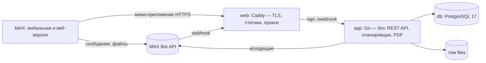

# Приёмка — рабочее место председателя совета МКД в MAX

Чат-бот [`t84_hakaton_max_bot`](https://max.ru/t84_hakaton_max_bot) и мини-приложение для приёмки актов выполненных работ управляющей компании по порядку, утверждённому приказом Минстроя России от 22.05.2026 № 318/пр (действует с 01.09.2026).

Трек «Умный город», хакатон MAX × Минобрнауки.

## Назначение

С 01.09.2026 у председателя совета многоквартирного дома 10 дней со дня получения акта от УК, чтобы вернуть подписанный экземпляр или направить обоснованный отказ. Если за 30 дней ответа нет, акт считается оформленным со стороны совета. Графы «подписано с замечаниями» в форме акта (приказ № 761/пр) нет, поэтому выбор бинарный.

«Приёмка» делает пять вещей:
- ведёт сроки и напоминает о них;
- проверяет сроки самой УК;
- помогает проверить акт по строкам вместе с жильцами;
- формирует PDF — сопроводительное письмо к подписанному акту или мотивированный отказ с построчными возражениями и перечнем доказательств;
- ведёт цикл «отказ → новый акт → повторная проверка».

## Основной пользовательский сценарий

1. **Бот.** Председатель проходит онбординг (ФИО, квартира, основание полномочий, дом, УК, договор) и присылает акт, полученный от УК, — фото или PDF. Затем указывает дату и способ получения и отвечает, пришли ли два экземпляра с подписью УК.
2. **Бот.** Считает 10-й день (срок ответа) и 30-й день (молчаливая приёмка), ставит напоминания и проверяет сроки УК: оформление не позже 30 дней после оказания услуг и не позже окончания договора, направление не позже 5 дней после оформления, два подписанных экземпляра.
3. **Мини-приложение.** Председатель переносит в карточку реквизиты по форме 761/пр и строки акта (с подсказками из перечня ПП № 290). По каждой строке ставит статус «подтверждено / под сомнением / не выполнено», пишет комментарий и прикладывает фото. Сервис считает оспариваемую сумму и сверяет сумму строк с итогом акта.
4. **Жильцы.** Открывают текстовую ссылку `https://max.ru/t84_hakaton_max_bot?startapp=inv_…` из чата дома, выбирают подъезд и отмечают «было / не было / не знаю». Председатель видит только агрегаты и комментарии, без имён.
5. **Документ.** Кнопка «Отказаться от подписания» или «Подписать» формирует PDF. Бот присылает его файлом в чат, в мини-приложении его можно скачать.
6. **Отправка.** Председатель отмечает способ и дату отправки. После отказа он получает новый акт: строки копируются, ранее оспоренные помечены. Если 30 дней прошли без ответа, акт переходит в статус «принят молчанием».

## Состав и архитектура



| Компонент | Технологии | Роль |
|---|---|---|
| `backend/` → контейнер `app` | Go 1.26, официальная библиотека MAX Bot API, pgx, goose, maroto (PDF) | Бот (вебхук или long polling), REST API `/api/v1`, планировщик напоминаний (горутина раз в минуту), генерация PDF |
| `webapp/` → контейнер `web` | React 19, TypeScript, Vite, MAX UI, MAX Bridge; Caddy 2 | Мини-приложение; Caddy отдаёт статику, проксирует `/api` и `/webhook`, в проде получает сертификат Let's Encrypt |
| `db` | PostgreSQL 17 | Пользователи, дома, акты, строки, доказательства, ответы жильцов, документы, напоминания, история |
| `config/` | YAML/JSON | Правила приёмки с источниками, тексты сообщений и документов, справочник ПП № 290, демо-данные |
| `api/openapi.yaml` | OpenAPI 3.1 | Контракт API; из него генерируются TS-типы фронта (`npm run gen:api`) |

Устройство бэкенда: `internal/domain` — правила (сроки, проверки УК, суммы, статусы), чистые функции с тестами. `internal/rules` — загрузка правил, источников и текстов из `config/`. `internal/civil` — календарные даты. `internal/store` — SQL. `internal/app` — сценарии, общие для бота, API и планировщика (`scheduler.go`). `internal/bot` — диалог. `internal/api` — HTTP. `internal/maxbot` — работа с MAX. `internal/files` — хранение файлов и подписанные ссылки. `internal/pdf` — вёрстка документов. `internal/apicheck` — прогон `DATA-API.yaml`.

Правила как конфигурация. Сроки (10/30/30/5 дней, два экземпляра), способ счёта дней и график напоминаний лежат в `config/rules/acceptance.yaml`. У каждого правила указаны источник, редакция, дата сверки и происхождение: норма, расчёт сервиса, рекомендация или допущение. Интерфейс показывает эти данные у каждого срока и каждой проверки («Основание ›»).

## Запуск одной командой

```bash
docker compose up --build
```

После запуска откройте:
- мини-приложение и API: <http://localhost:8080>; в браузере без MAX — <http://localhost:8080/?dev_user=1>;
- проверку здоровья: <http://localhost:8080/healthz>.

По умолчанию бот выключен (`BOT_MODE=off`). Чтобы проверить бота локально, положите токен в `.env` и запустите `BOT_MODE=polling docker compose up --build`. Если у бота зарегистрирован вебхук (работает прод), polling откажется стартовать: снятие вебхука отключило бы прод-бота. Используйте отдельный токен или осознанно задайте `POLLING_TAKEOVER=true`.

### Необходимые параметры окружения

- Docker Engine 24+ с плагином Docker Compose v2, доступ в интернет для загрузки образов и зависимостей.
- Свободные порты 8080 и 8443 (меняются через `HTTP_PORT`, `HTTPS_PORT`).
- Сборка с пустым кэшем, без учёта загрузки базовых образов: компиляция и сборка фронта — меньше минуты; остальное — загрузка Go-модулей и npm-пакетов (около 300 МБ, в основном архив модуля pdfcpu). Замер 27.09: `app` — 286 с на канале около 1 МБ/с, `web` — 23 с; сервисы собираются параллельно.
- Если хост выходит в интернет через VPN с MTU меньше 1500:
  - запросы к MAX из контейнера зависают — задайте `DOCKER_MTU` (например, 1376). MTU сети меняется только через `docker compose down` и новый `up`: на запущенном стеке compose пересоздаёт сеть и останавливает контейнеры;
  - `DOCKER_MTU` не действует на сборку: если зависает `go mod download` или `npm ci`, задайте `"mtu": 1376` в `/etc/docker/daemon.json` или соберите образы с сетью хоста (`docker build --network host -f backend/Dockerfile -t priemka-app .`, затем `docker compose up -d --no-build`).

### Переменные окружения

Все переменные перечислены с комментариями в `.env.example`. Секретов в репозитории нет. Значения по умолчанию — те, что подставляет `compose.yaml`.

| Переменная | По умолчанию | Назначение |
|---|---|---|
| `MAX_BOT_TOKEN` | — | Токен бота: нужен боту и для проверки подписи initData |
| `BOT_MODE` | `off` | `off`, `polling` (только локально) или `webhook` (прод) |
| `POLLING_TAKEOVER` | `false` | Разрешить polling снять зарегистрированный вебхук (отключит прод-бота) |
| `BOT_USERNAME` | `t84_hakaton_max_bot` | Ник бота для диплинков (при подключённом боте берётся из `/me`) |
| `PUBLIC_URL`, `WEBHOOK_SECRET` | — | Прод: адрес `https://домен` и секрет вебхука |
| `SITE_ADDRESS` | `:80` | Прод: домен — Caddy получит сертификат Let's Encrypt |
| `HTTP_PORT`, `HTTPS_PORT` | `8080`, `8443` | Публикуемые порты; в проде `80` и `443` |
| `POSTGRES_PASSWORD` | `priemka` | Пароль БД |
| `FILES_SECRET` | локальное значение | Ключ подписи ссылок на файлы; в проде — случайная строка |
| `DEMO_MODE` | `true` | Демо-профиль, демо-акт, перемотка времени демо-актов |
| `DEV_AUTH` | `true` | Вход в API заголовком `X-Dev-User` без MAX; при `BOT_MODE=webhook` сервис не стартует |
| `TEST_ACCOUNTS` | — | Тестовые учётки API: `chairman:<токен>,resident:<токен>` |
| `INIT_DATA_TTL` | `24h` | Срок годности initData |
| `LOG_LEVEL`, `DOCKER_MTU` | `info`, `1500` | Логи; MTU docker-сети |

Для запуска бэкенда без Docker дополнительно: `DATABASE_URL`, `CONFIG_DIR`, `FONTS_DIR`, `FILES_DIR`, `HTTP_ADDR` (в образе заданы `/app/config`, `/app/assets/fonts`, `/data/files`, `:8080`) и `EXTRA_CA_FILE` — путь к `certs/rootca_ssl_rsa2022.crt`. Без compose `DEMO_MODE` и `DEV_AUTH` по умолчанию выключены.

### Используемые порты

| Порт | Где | Что |
|---|---|---|
| 8080 → 80 | `web` | HTTP: мини-приложение, `/api`, `/webhook`, `/healthz` |
| 8443 → 443 (TCP и UDP) | `web` | HTTPS и HTTP/3 (в проде, когда `SITE_ADDRESS` — домен) |
| 8080 (внутренний) | `app` | Бэкенд, доступен только из сети compose |
| 5432 (внутренний) | `db` | PostgreSQL, наружу не публикуется |

### Зависимости

Версии зафиксированы: `backend/go.mod` + `backend/go.sum`, `webapp/package.json` (точные версии) + `webapp/package-lock.json`. Базовые образы: сборочные зафиксированы до патча (`golang:1.26.8-alpine`, `node:24.21.0-alpine`), рабочие — до минорной версии, чтобы получать исправления безопасности (`alpine:3.22`, `caddy:2.11-alpine`), PostgreSQL — до мажорной (`postgres:17-alpine`: формат данных меняется только между мажорными версиями). Всё под свободными лицензиями:

| Библиотека | Лицензия |
|---|---|
| max-bot-api-client-go (официальная библиотека MAX) | Apache-2.0 |
| @maxhub/max-ui | MIT |
| pgx, goose, maroto, phpdave11/gofpdf | MIT |
| pdfcpu (зависимость maroto) | Apache-2.0 |
| go.yaml.in/yaml/v3 (конфиг, `DATA-API.yaml`) | MIT и Apache-2.0 |
| kin-openapi (только тесты: контракт с `openapi.yaml`) | MIT |
| React, Vite, openapi-typescript | MIT |
| TypeScript | Apache-2.0 |
| lightningcss (сборка CSS в Vite, в образ не попадает) | MPL-2.0 |
| Шрифт PT Serif (ParaType) | SIL OFL 1.1 (`assets/fonts/OFL.txt`) |

## Внешние сервисы и интеграции

| Сервис | Зачем | Можно ли воспроизвести в Docker |
|---|---|---|
| MAX Bot API (`platform-api2.max.ru`) | Сообщения, кнопки, приём файлов, отправка PDF, вебхук | Нет. Нужен токен бота; локально работает через long polling |
| MAX Bridge (`st.max.ru/js/max-web-app.js`) | initData, диплинк `startapp`, `downloadFile`, `BackButton` | Нет. Мини-приложение открывается только из MAX по HTTPS; локально — в браузере с `?dev_user=` |
| Let's Encrypt | Сертификат для домена мини-приложения и вебхука | Используется только в проде |

Сертификат `platform-api2.max.ru` выдан УЦ Минцифры (Russian Trusted Sub CA). Поэтому в образ `app` добавлен корневой сертификат Минцифры `certs/rootca_ssl_rsa2022.crt` (публикуется на Госуслугах). Проверка TLS не отключается.

Интеграций с ГИС ЖКХ, ГАР/ФИАС и электронной подписью нет — сознательно (см. «Ограничения»). Имитаций интеграций тоже нет.

## Работа с данными

- **Что храним:** имя пользователя из MAX; профиль председателя (ФИО, квартира, основание полномочий); дом и договор; акты, их строки и оценки; файлы (исходный акт, фото-доказательства, сформированные PDF); ответы жильцов (подъезд, ответ, комментарий); историю событий. Телефон и геолокацию не запрашиваем.
- **Где:** PostgreSQL (том `db-data`) и файлы на томе `files`. Файлы выдаются только по подписанной ссылке со сроком 30 минут.
- **Кто видит:** акт виден только председателю его дома — проверка на каждом запросе, чужой акт → 403. Жилец видит строки без цен и только свои ответы. Председатель видит ответы жильцов агрегатами, без имён. В документ попадает число ответивших, но не их имена.
- **Согласие:** председатель даёт согласие в боте при старте, жилец — в мини-приложении перед отправкой ответов. Удаление всех данных — команда `/delete`. Отдельный акт удаляется кнопкой «🗑 Удалить акт» в боте или в карточке мини-приложения вместе со строками, фото, документами и ответами жильцов: демо-акт — всегда, настоящий — пока документ не отмечен отправленным в УК (после этого акт — история переписки с исполнителем).
- **Аутентификация:** мини-приложение передаёт `window.WebApp.initData`; сервер проверяет подпись (HMAC-SHA256, ключ от токена бота) и срок `auth_date`.

## Тестовые и подготовленные данные

Все подготовленные данные помечены в интерфейсе, в документах и здесь:

| Данные | Откуда | Пометка |
|---|---|---|
| Справочник работ `config/catalog/pp290.json` (147 позиций) | Текст ПП РФ от 03.04.2013 № 290 в ред. от 07.03.2025 № 293, разобран автоматически | Подготовленные данные, источник и редакция указаны в файле и в подсказках |
| Демо-профиль, дом, УК, договор, акт с 8 строками (`config/demo/demo-act.json`) | Синтетика: «г. Демоград, ул. Тестовая, д. 1», «ООО «УК Пример» (вымышленная организация)», цены вымышлены | Бейдж «ДЕМО» в интерфейсе, водяной знак «ДЕМО — синтетические данные» в PDF |
| `demo/act-demo.pdf` | Синтетический акт по форме приказа № 761/пр, сформирован `go run ./cmd/demoact` | Водяной знак на странице |
| Правила сроков | Приказы № 318/пр и № 761/пр. Где норма не однозначна — помечено как допущение (`kind: assumption`) | Метки «Норма / Расчёт / Рекомендация / Допущение» у каждого утверждения |

Демо-режим (`DEMO_MODE=true`):
- кнопки «Заполнить демо-профилем» и «Взять демо-акт» в боте;
- кнопка «Создать демо-акт» в мини-приложении;
- перемотка времени у демо-актов: `/demo` в боте или карточка «Демо-режим» в мини-приложении.

Сдвиг хранится у конкретного акта и не влияет на другие акты и других пользователей.

Пока профиль демо, акты, присланные файлом, тоже помечаются «ДЕМО»: их шапка (адрес, УК, договор) берётся из вымышленного профиля, поэтому снять пометку нельзя. Для настоящего акта заполните профиль своими данными («Профиль» → «Изменить»), ненужные демо-акты удалите.

Тестовые учётки собственного API (`TEST_ACCOUNTS`): при старте создаются председатель с демо-домом, демо-актом «на проверке» и приглашением, а также жилец. Если демо-акт председателя уходит в финальный статус (например, «принят молчанием» через 30 дней), планировщик создаёт новый — проверки можно повторять весь период проверки. Токены передаются на первом слайде презентации. Проверки описаны в `DATA-API.yaml`, прогон — `scripts/check-api.sh <base_url> <chairman> <resident>` (нужен Go): скрипт читает сам `DATA-API.yaml` и сверяет код, `Content-Type` и обязательные поля ответа.

## Пошаговый сценарий проверки (≈ 10 минут)

| # | Действие | Ожидаемый результат |
|---|---|---|
| 1 | Открыть <https://max.ru/t84_hakaton_max_bot>, нажать «Начать» | Приветствие, кнопка «Согласен на обработку данных» |
| 2 | «Согласен» → «🧪 Заполнить демо-профилем» | «Профиль заполнен синтетическими данными (ДЕМО)», меню |
| 3 | «🧪 Взять демо-акт» (или прислать файл `demo/act-demo.pdf` и затем любой способ) | «Создан демо-акт № 17 с 8 строками» и вопрос «Когда вы получили акт?» |
| 4 | «Сегодня» → «Лично» → «Да, два подписанных» | Сводка: «Ответить до … (10-й день)», «…акт будет считаться оформленным (30-й день)», основание, проверка сроков УК («⚠️ Акт получен через 8 дн. после оформления…»), кнопки «Открыть проверку», «Пригласить жильцов», «Демо: перемотать время» |
| 5 | «🔍 Открыть проверку» | Мини-приложение: карточка акта, сроки с меткой «Основание ›», проверки УК, итоги, 8 строк |
| 6 | Строка 6 «Очистка кровли…» → «Не выполнено», комментарий → «Сохранить комментарий»; строка 2 «Мытьё окон» → «Под сомнением», «📷 Добавить фото» | Уведомления «Сохранено», «Доказательство добавлено»; в итогах «Оспаривается: 14 100,00 ₽ (2 строки)» |
| 7 | «Добавить строку», ввести «уборк» | Подсказки из ПП № 290 с указанием пункта |
| 8 | В боте «👥 Пригласить жильцов» | Два сообщения: пояснение и готовый текст со ссылкой `…?startapp=inv_…` для пересылки |
| 9 | Открыть ссылку (другим аккаунтом или своим — в демо разрешено) | Экран жильца: подъезды 1–4, строки без цен, «Было / Не было / Не знаю», согласие → «Спасибо! Ответ учтён» |
| 10 | Вернуться в карточку акта | У строк «👥 было N / не было M», «Ответили: N» |
| 11 | Демо-режим: «К 9-му дню» | Баннер «Сейчас 9-й день»; в течение минуты бот пишет «⚠️ Акт № 17: завтра, …, последний день для ответа исполнителю…» |
| 12 | «Отказаться от подписания» → «Сформировать PDF» | «Документ готов и отправлен вам в чат с ботом». В чате PDF: таблица возражений, итог спора, перечень доказательств Д-1…, водяной знак ДЕМО |
| 13 | В сообщении с PDF «📮 Отметить отправку в УК» → «Лично» → «Сегодня» | «Отмечено… После отказа исполнитель оформляет новый акт…», кнопка «Получил новый акт» |
| 14 | «📄 Получил новый акт» → прислать файл → «Сегодня» | Новый акт; строки скопированы, ранее оспоренные помечены «оспаривалась ранее» |
| 15 | Для нового акта «К 31-му дню» | Бот: «Прошло 30 дней… Акт считается оформленным со стороны совета»; статус «Принят молчанием», изменения заблокированы |
| 16 | Ошибки: текст вместо даты; файл больше 20 МБ; отказ без возражений | «Не понял дату…»; «Файл больше 20 МБ…»; «Для отказа нужна хотя бы одна строка…» — работу можно продолжить без перезапуска |

Сценарий работает и в мобильной, и в веб-версии MAX. Если метод Bridge недоступен (например, `downloadFile`), документ всё равно приходит файлом в чат.

## Примеры ожидаемого поведения API

```bash
# локально, DEV_AUTH=true
curl -s -H 'X-Dev-User: 1' localhost:8080/api/v1/me          # 200 {"mode":"chairman","profile_complete":false,...}
curl -s localhost:8080/api/v1/acts                             # 401 {"error":{"code":"UNAUTHORIZED",...},"request_id":"..."}
curl -s -H 'X-Dev-User: 1' -X POST localhost:8080/api/v1/acts/demo   # 201 карточка демо-акта
# отказ без возражений → 422 NO_OBJECTIONS; подписание при спорных строках → 422 DISPUTED_LINES;
# удаление акта: DELETE /api/v1/acts/{id} → 204; отправленный настоящий акт → 409 ACT_SENT;
# правка закрытого акта → 409 ACT_LOCKED; чужой акт → 403 FORBIDDEN; файл не того типа → 415 BAD_FILE_TYPE
```

Полный контракт — `api/openapi.yaml`.

## Известные ограничения

- Строки акта вводятся вручную (с подсказками ПП № 290): распознавания фото и PDF нет.
- Документ — шаблон. Правовые формулировки не проверены юристом. Номера пунктов приказа № 318/пр в документах не указываются, пока текст не сверен с первоисточником.
- Дни считаются календарными, со следующего дня после получения, без переноса с выходных. Это допущение: в приказе сказано просто «дней». Параметры — в `config/rules/acceptance.yaml`.
- Юридически значимой электронной подписи нет. Документ подписывается на бумаге или сканом и отправляется председателем самостоятельно.
- Нет интеграции с ГИС ЖКХ: API доступен только организациям — поставщикам информации.
- Сервис не проверяет, что жилец действительно живёт в указанном подъезде; в документе ответы жильцов помечены как непроверенные.
- Бот не пишет в официальные домовые чаты и не добавляет людей в чаты. Приглашение пересылает сам председатель.
- В локальном запуске мини-приложение открывается в браузере (`?dev_user=`), а не в MAX: MAX требует HTTPS-домен.
- Часовой пояс один на весь сервис — из `config/rules/acceptance.yaml` (`Europe/Moscow`): от него зависят «сегодня», сроки и час напоминаний. Поле `houses.timezone` в БД зарезервировано и пока не используется.
- Демо-акт у пользователя с заполненным настоящим профилем берёт в шапку его ФИО и адрес дома; строки, исполнитель и цены — синтетические, акт и PDF помечены «ДЕМО».
- Ссылки на файлы действуют 30 минут; мини-приложение обновляет их при возврате на экран.

## Остановка и повторный запуск

```bash
docker compose stop            # остановить, данные сохраняются
docker compose up -d           # запустить снова
docker compose down            # удалить контейнеры, тома с данными остаются
docker compose down -v         # удалить всё, включая БД и файлы
docker compose logs -f app     # логи бэкенда
```

Смена `DOCKER_MTU` — только через `docker compose down` и `docker compose up -d`. Значение должно быть одним и тем же при каждом запуске (удобнее всего — в `.env`): если запустить `up` с другим MTU поверх существующих контейнеров, compose пересоздаст сеть, контейнеры потеряют имена сервисов, и `app` не стартует с ошибкой `lookup db on 127.0.0.11:53: server misbehaving`. Лечится `docker compose down` и `docker compose up -d`.

## Развёртывание (прод)

Нужен сервер с публичным IPv4 (Ubuntu 22.04/24.04), Docker с Compose v2 и домен с A-записью на сервер. Вместо своего домена можно использовать имя вида `<IP>.sslip.io`. Порты 80 и 443 (TCP и UDP) должны быть открыты: вебхук MAX принимается только на 443.

Минимум — 1 vCPU, 1 ГБ RAM, 20 ГБ диска. В работе стек занимает около 50 МБ памяти; пик — при сборке на сервере (компиляция Go — до 400 МБ, сборка фронта — ещё около 300 МБ). На 1 ГБ RAM перед первой сборкой добавьте swap и собирайте образы по очереди:

```bash
fallocate -l 2G /swapfile && chmod 600 /swapfile && mkswap /swapfile && swapon /swapfile
echo '/swapfile none swap sw 0 0' >> /etc/fstab
```

```bash
git clone <репозиторий> priemka && cd priemka
cat > .env <<EOF
MAX_BOT_TOKEN=<токен>
BOT_MODE=webhook
PUBLIC_URL=https://<домен>
WEBHOOK_SECRET=$(openssl rand -hex 24)
SITE_ADDRESS=<домен>
HTTP_PORT=80
HTTPS_PORT=443
POSTGRES_PASSWORD=$(openssl rand -hex 16)
FILES_SECRET=$(openssl rand -hex 24)
DEMO_MODE=true
DEV_AUTH=false
TEST_ACCOUNTS=chairman:$(openssl rand -hex 16),resident:$(openssl rand -hex 16)
EOF
docker compose build app && docker compose build web   # по очереди: меньше пик памяти
docker compose up -d
```

После этого:
1. Caddy получит сертификат Let's Encrypt, а бот зарегистрирует вебхук `https://<домен>/webhook`.
2. В кабинете MAX для партнёров укажите у бота адрес мини-приложения: `https://<домен>`.
3. Проверка собственного API против прода: `scripts/check-api.sh https://<домен>/api/v1 <токен chairman> <токен resident>`; адрес прода — в `base_url` файла `DATA-API.yaml`.
4. Ежедневная резервная копия БД и файлов (хранится 14 дней, восстановление — в шапке скрипта):
   `crontab -e` → `30 3 * * * cd <путь к priemka> && mkdir -p backups && scripts/backup.sh >> backups/backup.log 2>&1`.

## Структура репозитория

```
backend/     Go: cmd/app (сервис), cmd/demoact (демо-акт), cmd/checkapi (проверки DATA-API.yaml), internal/*, migrations/
webapp/      мини-приложение: React + TS + MAX UI, Caddyfile
api/         openapi.yaml
config/      rules/ (правила и источники), templates/ (тексты сообщений и документов, YAML), catalog/ (ПП № 290), demo/ (демо-акт)
assets/fonts PT Serif + OFL
certs/       корневой сертификат Минцифры
demo/        act-demo.pdf
docs/        требования, контекст, план
DATA-API.yaml, scripts/check-api.sh — проверки собственного API
scripts/check.sh — обязательные проверки кода (vet, staticcheck, тесты, govulncheck, tsc, npm audit)
scripts/backup.sh — резервная копия БД и файлов
```
