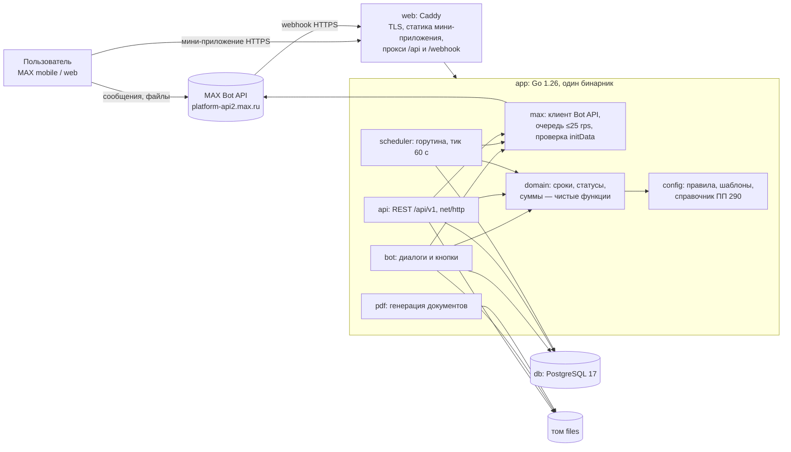
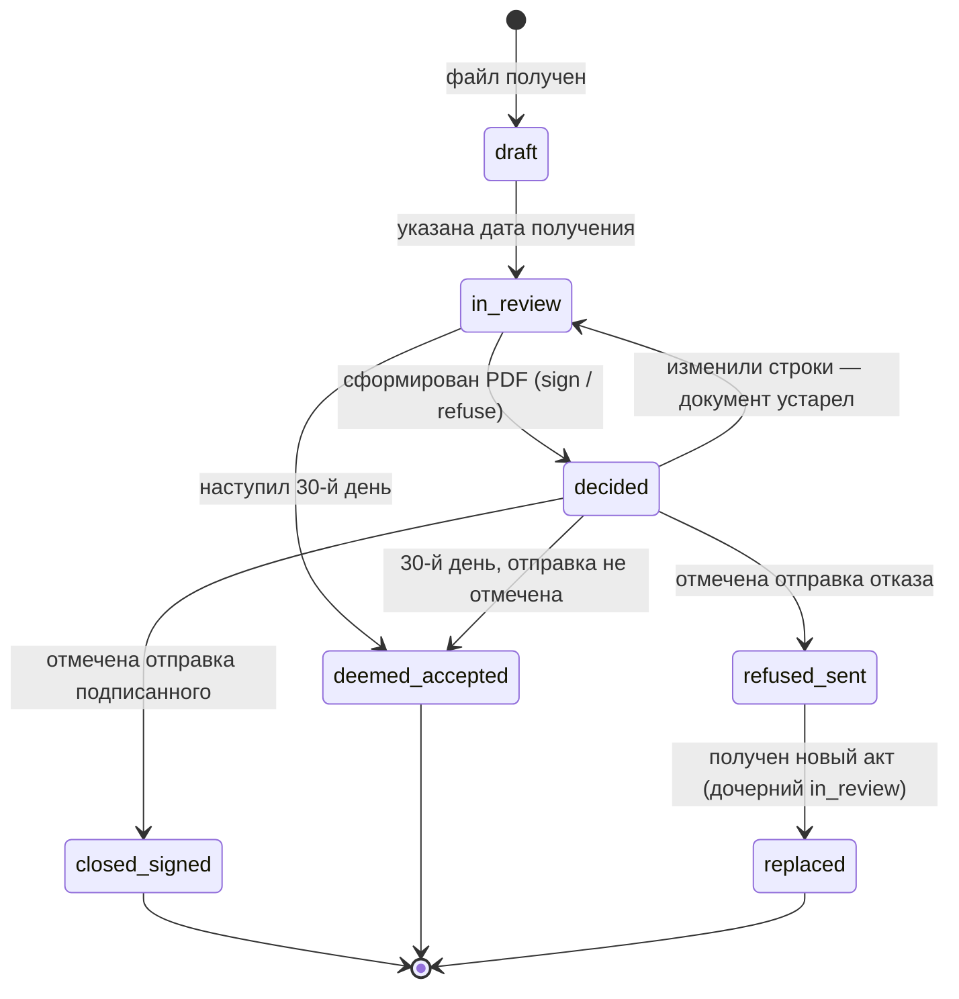

# План реализации «Приёмка» (MVP к 29.09.2026)

Входные документы: `docs/requirements.md` (REQ-xx, вопросы О-x, противоречия П-x), `docs/context.md` (окружение, платформа, риски среды).
Срок: 25.09 — 29.09. Стек: Go 1.26 (бэкенд) + TypeScript/React (мини-приложение). Исполнитель критического пути — Р1; вариант с помощником Р4 на презентации и README — в §8.
Все утверждения, которых нет в справочных фактах и в analysis.md, помечены **ASSUMPTION**.

---

## 1. Границы MVP (MoSCoW)

### Must Have — без этого основной сценарий не проходит

| ID | Функция | REQ |
|---|---|---|
| M-01 | Онбординг председателя в боте: согласие на обработку ПДн, профиль (ФИО, № квартиры, основание полномочий — решение ОСС или доверенность, дата, номер), дом (город, адрес, число подъездов), исполнитель и договор; вопрос о применимости порядка (совет обязателен, есть полномочия) | REQ-36, REQ-43 |
| M-02 | Приём акта в боте: фото или PDF, дата получения, способ получения, пришли ли оба экземпляра с подписью УК | REQ-36 |
| M-03 | Расчёт сроков: 10-й день (ответ), 30-й день (молчаливая приёмка); проверки УК: оформление ≤ 30 дней со дня оказания услуг и не позже окончания договора, направление ≤ 5 дней со дня оформления, 2 подписанных экземпляра. У каждого результата — основание | REQ-56 |
| M-04 | Напоминания ботом по графику из конфига; автоматический переход в «принят молчанием» на 30-й день | REQ-68 |
| M-05 | Мини-приложение: карточка акта по форме 761/пр, строки с автоподсказкой из ПП № 290, статус строки (подтверждено / под сомнением / не выполнено), комментарий, фото-доказательства; суммы: итог, оспариваемая сумма, расхождение суммы строк с п. 2 акта | REQ-65 |
| M-06 | Жильцы по текстовому диплинку: согласие, выбор подъезда, ответ «было / не было / не знаю» и комментарий по строкам, открытым для жильцов; у председателя — агрегаты | REQ-53 |
| M-07 | PDF: сопроводительное письмо к подписанному акту **или** мотивированный отказ с построчными возражениями и перечнем доказательств; доставка файлом от бота и скачиванием из мини-приложения | REQ-68 |
| M-08 | Отметка отправки в УК (способ, дата), статусы, история событий, цикл «отказ → новый акт → повторная проверка» | REQ-66 |
| M-09 | Демо-режим: демо-профиль, демо-акт одной кнопкой, сдвиг времени акта для показа 10-го и 30-го дня | REQ-68, REQ-44 |
| M-10 | Состояния загрузки, успеха и ошибки в боте и мини-приложении; работа в мобильной и веб-версии | REQ-65, REQ-37, REQ-70 |
| M-11 | Комплект сдачи: README, Docker, `.env.example`, lock-файл, презентация | REQ-01…REQ-29 |

### Should Have — делаем только после всех Must или силами помощников

| ID | Функция | Оценка | REQ |
|---|---|---|---|
| S-01 | «Чат совета»: председатель сам добавляет бота в групповой чат совета, открывает мини-приложение из чата (тип и id чата — из initData), и чат привязывается к дому; бот держит закреплённое сообщение «Акт № …: осталось N дней» и обновляет его при событиях и раз в сутки. **Кандидат на платформенный бонус** | 3,0 ч | REQ-74 |
| S-02 | Фото от жильцов к ответу | 1,0 ч | — |
| S-03 | Приложение к отказу с миниатюрами фото | 1,0 ч | — |
| S-04 | — (перенесено в Must как T29: у нас собственный API) | — | — |
| S-05 | Проверка арифметики строки (стоимость за единицу × количество = цена) | 0,5 ч | — |
| S-06 | PDF-листовка для подъезда с QR-кодом диплинка | 1,0 ч | — |
| S-07 | Совместная проверка несколькими членами совета | 2,0 ч | — |
| S-08 | Команда «Удалить мои данные» | 0,5 ч | REQ-72 |

### Could Have — не будет сделано к 29.09, в презентации как следующие шаги

C-01 извлечение строк из PDF с текстовым слоем; C-02 подсказки адреса из ГАР/ФИАС; C-03 расчёт уменьшения платы по Правилам к ПП № 491 (формула из справочных фактов); C-04 отчёт жильцам через `shareMaxContent`; C-05 коллективный акт о нарушении качества КУ (ПП № 354); C-06 рабочие дни с производственным календарём.

### Won't Have — сознательно не делаем

| ID | Что | Почему |
|---|---|---|
| W-01 | Интеграция с ГИС ЖКХ | API только для организаций — поставщиков информации |
| W-02 | Юридически значимая электронная подпись | Вне зоны доступа; документ подписывается на бумаге или сканом |
| W-03 | Автоматическая отправка документов в УК, модуль для УК | Нет согласованного канала; председатель отправляет сам и отмечает факт |
| W-04 | OCR фото акта | Не успеваем качественно; строки вводятся вручную с автоподсказкой |
| W-05 | Юридические советы от LLM | Риск выдать догадку за норму (REQ-58) |
| W-06 | Бот добавляет людей в чаты или пишет в официальные домовые чаты | Метод удалён; чатами владеет надзор |
| W-07 | Проверка, что жилец — собственник или живёт в указанном подъезде | Нет источника данных; ответы жильцов в документе помечены «сведения жильцов, не проверены» |
| W-08 | Геолокация и геоподтверждение фото | Поддержка в веб-версии не подтверждена (REQ-37) |
| W-09 | Сбор телефона через `request_contact` | Для документов не нужен; минимизация ПДн |
| W-10 | ОСС, опросы, заявки в УК, навигатор по дому | Дублируют госсервисы (analysis.md) |
| W-11 | DeviceStorage, SecureStorage, shareContent, HapticFeedback, биометрия | Не работают в вебе (REQ-55) |
| W-12 | Счёт «дней» в рабочих днях | Нужен производственный календарь; параметр есть, в MVP только календарные дни |

---

## 2. Архитектура

Стек (решение команды от 25.09): бэкенд на **Go 1.26**, мини-приложение на **TypeScript + React**.



Потоки:
1. **Сообщение пользователя** → MAX → `POST /webhook/<секрет>` → `bot` → `domain` → `db` → ответ через `max` (очередь исходящих).
2. **Мини-приложение** → `GET/POST /api/v1/...` с заголовком `X-Max-Init-Data` → проверка подписи → проверка доступа к акту → `domain` → `db`.
3. **Напоминания**: `scheduler` раз в минуту выбирает наступившие напоминания (`FOR UPDATE SKIP LOCKED`), отправляет, ставит `sent_at`.
4. **Документ**: `POST /api/v1/acts/{id}/decision` → `pdf` → файл в том → загрузка в MAX → сообщение с файлом в чат председателя.

| Решение | Обоснование (масштаб MVP) | Критерий |
|---|---|---|
| Бэкенд на Go 1.26 | Решение команды. Есть официальная Go-библиотека MAX. Один статический бинарник, сборка за секунды; горутины закрывают планировщик и очередь без внешних компонентов | REQ-71, REQ-25 |
| Мини-приложение: TypeScript + React + Vite + MAX UI | React рекомендован ТЗ; MAX UI даёт стиль платформы | REQ-38, REQ-65 |
| Контракт — `api/openapi.yaml` как единственный источник. TS-типы генерируются из него (openapi-typescript, MIT); ответы бэкенда проверяются по схеме в контрактном тесте (kin-openapi, MIT) | Два языка — значит, общий контракт нужен явно; закрывает REQ-31 для собственного API | REQ-69, REQ-31 |
| HTTP на стандартном `net/http` (маршруты с методом и параметрами пути — в stdlib с Go 1.22) | Без фреймворка — меньше зависимостей | REQ-72, REQ-71 |
| Один процесс `app` с пакетами `internal/*`, а не отдельные сервисы | Нагрузка — единицы пользователей; меньше точек отказа. Границы пакетов позволяют вынести `scheduler` и `pdf` позже | REQ-71, REQ-70 |
| PostgreSQL 17, pgx v5 (MIT), SQL-миграции во встроенных файлах (`embed`) + goose (MIT) при старте | Транзакции и `SKIP LOCKED` для идемпотентных напоминаний; без ORM SQL прозрачен | REQ-69, REQ-72 |
| Конфиг — YAML (`gopkg.in/yaml.v3`) с проверкой при старте; тексты — `text/template` из stdlib | Правила и тексты меняются без правки кода | REQ-56, REQ-61 |
| PDF — maroto v2 (MIT) поверх go-pdf/fpdf: сетка строк и колонок, перенос текста в ячейках, UTF-8 TTF. **ASSUMPTION:** лицензия и поддержка кириллицы сверяются в T18; план Б — go-pdf/fpdf напрямую (`AddUTF8Font`) | Таблица возражений без ручной вёрстки; без Chromium сборка укладывается в лимит | REQ-25, REQ-68 |
| Файлы на docker-томе, а не в S3 | Объём — мегабайты; S3 — лишний сервис | REQ-71 |
| Caddy как фронт | Автоматический сертификат Let's Encrypt; одна конфигурация для локального запуска и прода | REQ-47, REQ-50 |
| Образ app: `golang:1.26` (сборка) → `alpine` (ca-certificates + корневой сертификат Минцифры) | Маленький образ; Go берёт системное хранилище сертификатов, так что достаточно `update-ca-certificates` | REQ-25, REQ-72 |
| Режимы через env: `BOT_MODE=off/polling/webhook`, `DEMO_MODE`, `DEV_AUTH` | Один образ для локального запуска и прода. `DEV_AUTH` запрещён при `BOT_MODE=webhook` — процесс не стартует | REQ-50, REQ-72 |

Структура репозитория:

```
backend/    go.mod, go.sum, cmd/app/main.go,
            internal/{max,bot,api,domain,pdf,scheduler,config,store},
            migrations/*.sql, Dockerfile
miniapp/    React + Vite + TS, package.json, package-lock.json,
            Dockerfile (сборка статики → образ Caddy), Caddyfile
api/        openapi.yaml — контракт, источник TS-типов
config/     rules/*.yaml, templates/*.tmpl, catalog/pp290.json
assets/fonts/  PT Serif (OFL) + OFL.txt
certs/      корневой сертификат Минцифры + README с источником
demo/       синтетический акт (json + pdf), пометки
compose.yaml  .env.example  .dockerignore  README.md  presentation.pdf
```

---

## 3. Модель данных

Типы: `id` — uuid, деньги — `numeric(14,2)`, даты сроков — `date` (календарные дни в часовом поясе дома), моменты — `timestamptz`.

| Таблица | Ключевые поля | Примечание |
|---|---|---|
| `users` | `max_user_id` (unique), `first_name`, `last_name`, `consent_at`, `created_at` | Только данные из initData / апдейта |
| `houses` | `city`, `address`, `entrances_count`, `timezone`, `chairman_user_id`, `council_chat_id` (S-01) | «Город» и «адрес МКД» из формы |
| `chairman_profiles` | `user_id`, `house_id`, `full_name`, `apartment_no`, `authority_type` (`oss_decision` / `power_of_attorney`), `authority_date`, `authority_number`, `applicability_confirmed` | Строка «в лице … кв. № … на основании …» |
| `contracts` | `house_id`, `type` (`management` / `services` / `repair`), `number`, `date`, `end_date` | «Вид и реквизиты договора»; `end_date` — для проверки оформления не позже окончания договора |
| `acts` | см. ниже | Карточка = форма 761/пр |
| `act_lines` | `act_id`, `position`, `work_name`, `pp290_ref`, `periodicity_qty` (text), `unit`, `unit_price`, `amount`, `review_status` (`unchecked` / `confirmed` / `doubtful` / `not_done`), `comment`, `disputed_amount`, `resident_visible`, `entrances` int[] | Столбцы таблицы формы 761/пр + поля проверки |
| `files` | `storage_key`, `mime`, `size`, `sha256`, `original_name`, `uploaded_by` | Исходный акт, фото, PDF |
| `evidence` | `act_id`, `line_id`, `file_id`, `note`, `author_role`, `created_at`, `code` (`Д-1`, `Д-2`, …) | Перечень доказательств в отказе |
| `resident_invites` | `act_id`, `token` (16 символов, unique), `expires_at`, `revoked_at` | Токен, а не id акта: ссылку нельзя угадать |
| `resident_votes` | `line_id`, `user_id`, `entrance_no`, `answer` (`yes` / `no` / `unknown`), `comment`, `file_id` (S-02); unique(`line_id`, `user_id`) | Повторный ответ перезаписывает прежний |
| `documents` | `act_id`, `kind` (`cover_letter` / `refusal`), `file_id`, `rules_version`, `version`, `max_message_id`, `created_at` | Все версии документа хранятся |
| `dispatches` | `act_id`, `document_id`, `channel` (`post` / `email` / `executor_portal` / `in_person` / `other`), `channel_note`, `sent_on` | Способы — открытый перечень из 318/пр |
| `reminders` | `act_id`, `kind`, `due_on` (date), `due_hour`, `sent_at`, `attempts`, `last_error`; unique(`act_id`, `kind`) | Идемпотентность |
| `act_events` | `act_id`, `type`, `payload` jsonb, `actor_user_id`, `created_at` | История статусов |
| `bot_sessions` | `user_id`, `state`, `data` jsonb, `updated_at` | Состояние диалога |

**`acts` — поля формы 761/пр (1:1 с документом):**

| Поле формы | Колонка |
|---|---|
| Акт № / дата / г. | `number`, `act_date`, `city` |
| Адрес МКД | `address` (снимок на момент акта) |
| Заказчик: в лице ФИО, кв. №, на основании | `customer_full_name`, `customer_apartment`, `customer_authority_text` (снимки из профиля, редактируются) |
| Исполнитель; в лице ФИО, должность; на основании | `executor_name`, `executor_signatory_name`, `executor_signatory_position`, `executor_basis` |
| П. 1: вид договора, № и дата; № дома и адрес | `contract_type`, `contract_number`, `contract_date` |
| Таблица | `act_lines` |
| П. 2: период с/по, сумма, сумма прописью | `period_from`, `period_to`, `total_amount`, `total_amount_words` (как в акте) |
| П. 3, п. 4 | Фиксированный текст формы — не хранится, выводится в карточке с пояснением: подписание = согласие с этими пунктами |
| 2 экземпляра, подписи сторон | `copies_received` (int), `executor_signed` (bool) |

**Служебные поля `acts`:** `house_id`, `contract_id`, `parent_act_id` (новый акт после отказа), `source_file_id`, `received_on`, `received_channel`, `executor_sent_on` (если известна дата отправки УК), `status`, `decision`, `deadline_response_on`, `deadline_silent_on`, `rules_version`, `is_demo`, `demo_shift_days`, `created_at`.

**Статусы акта:**



Редактировать шапку и строки можно в `draft`, `in_review` и `decided`. В остальных статусах API отвечает 409.

---

## 4. Контракт API мини-приложения

База: `https://<домен>/api/v1`, JSON, UTF-8. Загрузка файлов — `multipart/form-data`.

**Аутентификация через initData.**
1. Мини-приложение берёт строку `initData` из MAX Bridge и передаёт её в каждом запросе заголовком `X-Max-Init-Data`.
2. Сервер проверяет подпись по алгоритму из документации MAX (**ASSUMPTION:** HMAC-SHA256 с ключом, производным от токена бота; сверить в T09), проверяет `auth_date` не старше `INIT_DATA_TTL` (по умолчанию 24 ч) и делает upsert пользователя по `user.id`.
3. Состояние хранится без сессий и cookies. `start_param` определяет режим: `inv_<token>` — жилец, пусто — председатель.
4. Доступ: председатель — к актам своего дома; жилец — только к разрешённым строкам акта из приглашения. Проверка на каждом запросе.
5. Файлы отдаются по подписанной ссылке `GET /files/{id}?exp=…&sig=…` (HMAC, 10 минут), потому что `` не может отправить заголовок.
6. `DEV_AUTH=true` (только локально): заголовок `X-Dev-User: <id>` вместо initData.
7. Тестовые учётки для проверки API (собственный API, REQ-32): `Authorization: Bearer <token>`. Токены ролей `chairman` и `resident` задаются в env `TEST_ACCOUNTS` на VPS и видят только демо-дом. Значения — только на первом слайде, в репозитории их нет. Если initData и bearer пришли одновременно, приоритет у initData.

**Формат ошибки:** `{"error": {"code": "ACT_LOCKED", "message": "Акт уже закрыт", "details": {...}}}`.
Коды: 400 — неверный JSON; 401 — нет initData или неверная подпись; 403 — нет доступа к объекту; 404 — не найдено; 409 — недопустимый переход статуса; 413 — файл больше лимита; 415 — неподдерживаемый тип файла; 422 — ошибка валидации полей; 429 — слишком часто; 500 — внутренняя ошибка (с `request_id`).

| Метод и путь | Роль | Назначение | Успех | Ошибки |
|---|---|---|---|---|
| `GET /me` | любой | Пользователь, профиль, режим по `start_param`, `demo_mode` | 200 | 401 |
| `GET /acts` | председатель | Список актов дома со статусами и сроками | 200 | 401 |
| `GET /acts/{id}` | председатель | Карточка, строки, суммы, сроки с основаниями, проверки УК, агрегаты жильцов, документы | 200 | 401, 403, 404 |
| `PATCH /acts/{id}` | председатель | Поля шапки (форма 761/пр), `received_on`, `executor_sent_on` | 200 | 409, 422 |
| `POST /acts/{id}/lines` | председатель | Добавить строку | 201 | 409, 422 |
| `PATCH /lines/{lineId}` | председатель | Поля строки, статус, комментарий, видимость для жильцов | 200 | 403, 409, 422 |
| `DELETE /lines/{lineId}` | председатель | Удалить строку | 204 | 409 |
| `POST /lines/{lineId}/evidence` | председатель | Фото или документ (≤ 10 МБ; jpeg, png, webp, pdf) | 201 | 413, 415 |
| `DELETE /evidence/{id}` | председатель | Удалить доказательство | 204 | 409 |
| `GET /catalog/works?q=` | любой | Подсказки из ПП № 290 (≤ 10 результатов) | 200 | 422 |
| `GET /rules` | любой | Правила и источники (версия, редакция, дата сверки) | 200 | — |
| `POST /acts/{id}/invites` | председатель | Создать приглашение → `{token, link, text}`; бот дублирует текст в чат | 201 | 409 |
| `GET /invites/{token}` | жилец | Адрес, № акта, период, подъезды, строки для жильцов, мои ответы | 200 | 404, 410 (отозвано или истекло) |
| `PUT /invites/{token}/votes` | жилец | `{consent: true, entrance_no, votes: [{line_id, answer, comment}]}` | 200 | 409 (акт закрыт), 422 (нет согласия) |
| `POST /acts/{id}/decision` | председатель | `{decision: "sign" / "refuse", confirm_disputed?: bool}` → PDF и отправка в чат | 201 `{document_id}` | 409 (статус), 422 (отказ без оспоренных строк с комментарием; подписание при спорных строках без `confirm_disputed`) |
| `GET /documents/{id}/link` | председатель | Подписанная ссылка для `downloadFile` | 200 | 404 |
| `POST /acts/{id}/dispatch` | председатель | `{channel, channel_note?, sent_on}` | 201 | 409, 422 |
| `POST /acts/{id}/successor` | председатель | Новый акт после отказа: копия шапки и строк, ранее оспоренные строки помечены | 201 `{act_id}` | 409 |
| `POST /acts/{id}/demo-shift` | председатель | `{days}` или `{to_day: 9 / 11 / 31}`; только при `DEMO_MODE` и `is_demo` | 200 | 403, 409 |
| `GET /healthz` | — | Живость процесса и БД | 200 | 503 |

Бот использует тот же слой `domain`, что и API, а не HTTP-вызовы к нему. Загрузка акта идёт через бот: файл приходит вложением в сообщении.

---

## 5. Правила как конфигурация

**Где лежит:**
- `config/rules/acceptance.yaml` — сроки, параметры счёта дней, график напоминаний, источники;
- `config/templates/*.tmpl` — тексты документов и сообщений бота (`text/template`);
- `config/catalog/pp290.json` — справочник работ с метаданными редакции.

Конфиг загружается при старте, проверяется кодом (`internal/config`); при ошибке процесс не стартует.

```yaml
version: "2026-09-25.1"
sources:
  minstroy_318:
    title: "Порядок … утв. приказом Минстроя России от 22.05.2026 № 318/пр"
    effective_from: 2026-09-01
    effective_to: 2032-09-01
    edition: "исходная"              # ASSUMPTION: изменений не было — сверить в T07
    url: "<первоисточник, pravo.gov.ru>"
    checked_at: 2026-09-25
  minstroy_761: { title: "Приказ Минстроя России от 26.10.2015 № 761/пр", effective_from: 2016-02-16, … }
  pp_290:      { title: "ПП РФ от 03.04.2013 № 290", edition: "<ред. по состоянию на дату сверки>", … }
params:
  day_type: calendar            # calendar | working (working в MVP → ошибка конфигурации)
  counting_start: next_day      # ASSUMPTION: день 1 — следующий за днём получения
  shift_if_non_working: false   # ASSUMPTION: перенос с выходного не применяется
  timezone: Europe/Moscow       # ASSUMPTION: по умолчанию; у дома своё поле
rules:
  - id: council_response_days
    kind: norm                  # norm | calculation | recommendation | assumption
    value: 10
    source: minstroy_318
    point: null                 # номер пункта не сверен → в PDF не указывается
    summary: "10 дней со дня получения: вернуть подписанный экземпляр или направить обоснованный отказ"
  - { id: silent_acceptance_days, kind: norm, value: 30, source: minstroy_318, … }
  - { id: executor_drafting_max_days, kind: norm, value: 30, source: minstroy_318, … }
  - { id: executor_sending_max_days, kind: norm, value: 5, source: minstroy_318, … }
  - { id: copies_required, kind: norm, value: 2, source: minstroy_318, … }
  - id: service_day_is_period_end
    kind: assumption
    summary: "«День оказания услуг» считаем последним днём периода из п. 2 акта"
  - id: applicability_from
    kind: assumption
    value: 2026-09-01
    source_note: "analysis.md, письмо Минстроя № 50270-ДН/04 — не сверено"
reminders:                       # день от даты получения → шаблон сообщения
  - { day: 7,  template: remind_3_days_left }
  - { day: 9,  template: remind_tomorrow_last }
  - { day: 10, template: remind_today_last }
  - { day: 11, template: remind_response_overdue }   # recommendation: ответить как можно скорее
  - { day: 25, template: remind_silent_in_5 }
  - { day: 30, template: silent_acceptance_happened }
```

**Формулы** — чистые функции в `backend/internal/domain/` (`ComputeDeadlines`, `CheckExecutorTimeliness`, `SumDisputed`, `NextStatus`). Параметры — только из конфига, `eval` нет. Каждая функция возвращает `{value, kind, basis: [rule_id…]}`: результат несёт свои основания. Функции покрыты табличными `go test` на граничные даты: конец месяца, 29 февраля, получение сегодня и вчера (REQ-71).

**Показ источника пользователю** (REQ-56):
- в мини-приложении у каждого срока и каждой проверки есть метка «Норма / Расчёт сервиса / Рекомендация / Допущение» и ссылка «Основание ›». Она открывает карточку: название акта, пункт (если сверен), редакция, срок действия, дата сверки, ссылка на первоисточник;
- в боте под сводкой сроков — строка «Основание: порядок, утв. приказом Минстроя № 318/пр (сверено 25.09.2026)»;
- в PDF — ссылки на акты в тексте и строка в колонтитуле «Правила версии 2026-09-25.1»;
- у акта и документа хранится `rules_version`: при смене правил старые документы остаются воспроизводимыми.

---

## 6. Генерация документов

| Документ | Когда | Содержание | Шаблон |
|---|---|---|---|
| Сопроводительное письмо к подписанному акту | Решение «Подписать» | Кому (исполнитель из акта); от кого (председатель, кв., основание полномочий); «направляем подписанный экземпляр акта № … от … за период …»; дата; место для подписи | `templates/cover_letter.tmpl` |
| Мотивированный отказ от подписания акта | Решение «Отказаться» | Шапка как выше; дата и способ получения акта; нарушения сроков и порядка со стороны УК (если есть) с основаниями; **таблица возражений**: № строки акта, наименование, ед., цена по акту, статус, возражение, коды доказательств, ответы жильцов (да/нет/не знаю); итог «оспаривается X руб. из Y руб.»; просьба оформить новый акт; предложение согласительного совещания и осмотра общего имущества (рекомендация); **перечень доказательств** Д-1…Д-n (описание, дата, кто предоставил — роль, без ФИО жильцов); подпись | `templates/refusal.tmpl` |
| Синтетический акт по форме 761/пр | Только для демо-данных (`demo/act-demo.pdf`) | Все поля формы, таблица, п. 2–4, водяной знак «ДЕМО — синтетические данные» | `templates/act_761_demo.tmpl` |

- **Библиотека:** maroto v2 (MIT) поверх go-pdf/fpdf, генерация в `internal/pdf`. Сетка с переносом текста в ячейках подходит для таблицы возражений; сборка без Chromium укладывается в лимит (REQ-25). План Б — go-pdf/fpdf напрямую.
- **Кириллица:** стандартные шрифты PDF её не содержат, поэтому встраиваем TTF PT Serif как UTF-8 шрифт (SIL OFL 1.1, лицензия лежит рядом, REQ-41). Тест: генерация документа с кириллицей не падает, шрифт встроен; ручная проверка через `pdftotext` в T24.
- **Имя файла** — латиницей: `refusal_act-17_2026-09-03_v2.pdf` (кириллица в именах вложений — лишний риск).
- **Доставка** (REQ-55, REQ-37):
  1. основной путь — бот загружает файл в MAX и присылает сообщение с файлом в личный чат председателя, с кнопками «Отметить отправку в УК» и «Открыть акт»;
  2. в мини-приложении — «Скачать» через `downloadFile` по подписанной ссылке; если метод недоступен, показывается «Файл отправлен вам в чат с ботом».
- **Перед подписанием** бот и мини-приложение предупреждают: «В форме акта нет графы "с замечаниями": подписание означает согласие с п. 3–4. У вас N спорных строк». Подписать можно только с явным подтверждением.
- **Отказ без оспоренной строки с комментарием** — ошибка 422 с подсказкой, какую строку заполнить.
- **Правовые формулировки** не проверены юристом (ASSUMPTION). Об этом бот пишет в сообщении с файлом, а не в тексте документа.
- **Демо-документы** получают водяной знак «ДЕМО».

---

## 7. Сценарий проверки ревьюером (≈ 10 минут)

Условия: прод включён с `DEMO_MODE=true`, у проверяющего аккаунт MAX (мобильный или веб).

| # | Действие | Ожидаемый результат |
|---|---|---|
| 1 | Открыть `https://max.ru/t84_hakaton_max_bot`, нажать «Начать» | Приветствие: что делает бот, за сколько минут; кнопки «Согласен на обработку данных» и «Подробнее» |
| 2 | «Согласен» → «Заполнить демо-профиль» | Профиль «Демо Председатель», дом «г. Демоград, ул. Тестовая, д. 1 (ДЕМО)», договор управления; сообщение с бейджем «ДЕМО» |
| 3 | «Получил акт» → отправить `demo/act-demo.pdf` (ссылка в README) или любое фото; можно сразу нажать «Взять демо-акт» | Бот: «Файл принят (N КБ)». Вопрос «Когда получили?» с кнопками «Сегодня / Вчера / Другая дата» |
| 4 | «Сегодня» → способ «Лично» → «Оба экземпляра подписаны УК? Да» | Сводка: «Ответить до ДД.ММ (10-й день). Молчаливая приёмка ДД.ММ (30-й день)». Проверка УК: «Акт оформлен ДД.ММ, получен через 8 дней — возможное нарушение 5-дневного срока направления» с меткой «Расчёт сервиса» и основанием. Кнопка «Открыть проверку» |
| 5 | «Открыть проверку» | Мини-приложение: карточка акта по форме 761/пр, 8 строк, итог; сроки с метками и «Основание ›» |
| 6 | Строка «Очистка кровли от снега…» → «Не выполнено», комментарий; строка «Мытьё окон» → «Под сомнением», прикрепить фото | Статусы и фото сохраняются (индикатор → «Сохранено»); «Оспаривается: X руб. из Y руб.» пересчитывается сразу |
| 7 | Ввести в новую строку «уборк» | Подсказки из ПП № 290 с пометкой источника |
| 8 | «Пригласить жильцов» | В чат приходит текст со ссылкой `…?startapp=inv_…` для пересылки в чат дома |
| 9 | Открыть ссылку (другим аккаунтом или своим — в демо разрешено) | Режим жильца: согласие → подъезд → строки с кнопками «Было / Не было / Не знаю» → «Спасибо, ответ учтён» |
| 10 | Вернуться в карточку председателя | У строк агрегаты «Не было: 1» |
| 11 | В чате бота `/demo` → «Перейти к 9-му дню» | Баннер «ДЕМО: время акта сдвинуто на +9 дн.»; в течение минуты напоминание «Завтра последний день для ответа» |
| 12 | В мини-приложении «Отказаться от подписания» | Экран проверки: список оспоренных строк → «Сформировать» → индикатор → «Документ готов»; в чат приходит PDF отказа с таблицей, нарушением срока УК, перечнем доказательств и водяным знаком ДЕМО |
| 13 | В сообщении с PDF «Отметить отправку» → «Лично» → «Сегодня» | Статус «Отказ направлен, ожидаем новый акт»; в истории событий появилась запись |
| 14 | «Получил новый акт» → демо-файл → «Сегодня» | Новый акт связан с предыдущим; строки скопированы, ранее оспоренные помечены «оспаривалась в акте № …»; новые сроки от сегодняшней даты |
| 15 | Для нового акта `/demo` → «Перейти к 31-му дню» | Бот: «Прошло 30 дней без ответа — акт считается оформленным со стороны совета»; статус «Принят молчанием»; редактирование в мини-приложении заблокировано с понятным сообщением |
| 16 | Ошибки: текст вместо даты; файл больше 20 МБ; отказ без комментариев | «Не понял дату, пример: 25.09.2026»; «Файл больше 20 МБ, пришлите сжатую копию»; «Добавьте возражение хотя бы к одной строке» — и сценарий можно продолжать без перезапуска |
| 17 | Пройти шаги 3–13 в другой версии MAX (веб / мобильная) | То же поведение |

Сдвиг времени хранится у конкретного акта (`demo_shift_days`) и доступен только для `is_demo`-актов: проверяющие не мешают друг другу, реальные акты не затрагиваются.

---

## 8. Задачи и расписание

**Сдвиг.** Вечер 24.09 (D0) не использован, поэтому инфраструктура переезжает в D1. Переход на Go добавил 1 ч: +0,5 ч на OpenAPI и генерацию типов, +0,5 ч на вёрстку PDF.

**Ёмкость.** 25–28.09 по 14 ч + 29.09 ≈ 10 ч (если дедлайн в 18:00, О-3) — итого ≈ 66 ч.
**Сумма задач — 56 ч.** С буфером 30% это 73 ч, в одного человека не помещается. Два варианта:

- **А (рекомендую).** Р4 берёт T04, T25 и T27 (7 ч; не на критическом пути, черновики с D3). Р1 делает 49 ч задач + 16,5 ч буфера (34%) = 65,5 ч.
- **Б (строго один человек).** Урезать 5,5 ч заранее:
  - новый акт без копирования строк (−1 ч);
  - жильцы без выбора подъезда (−1 ч);
  - демо без демо-профиля, только кнопки «к 11-му» и «к 31-му дню» (−1 ч);
  - основания — текстом, без выдвижной карточки (−0,5 ч);
  - без внешнего пинга (−0,5 ч);
  - справочник ПП № 290 — только нужные разделы (−0,5 ч);
  - презентация — 3 ч вместо 4 (−1 ч).

  Итого 50,5 ч + 15,5 ч буфера (31%).

Р1 — ведущий разработчик (по умолчанию все задачи). Р2 — фронтенд, Р3 — документы и данные, Р4 — презентация и тексты. Колонка «Можно отдать» — кому задачу можно передать без блокировки критического пути.

### D1 — пт 25.09: инфраструктура и ядро. Р1: 12,0 ч + буфер 2,0 ч

| ID | Задача | Ч | Зависит от | Исп. | Можно отдать | Закрывает |
|---|---|---|---|---|---|---|
| T01 | Купить VPS (РФ, 2 vCPU / 2 ГБ), домен, A-запись; Docker на VPS. Пока DNS не делегирован — имя `<IP>.sslip.io` | 1,0 | — | Р1 (владелец аккаунтов) | — | REQ-01 |
| T02 | Каркас: `git init`, `backend/` (go mod, `cmd/app`, healthz), `miniapp/` (Vite + React + TS), `.gitignore`, `.dockerignore`, `.env.example`, `compose.yaml` (db, app, web), multi-stage Dockerfile, корневой сертификат Минцифры в образе | 2,0 | — | Р1 | — | REQ-20…24 |
| T03 | Caddy с Let's Encrypt на VPS, заглушка мини-приложения по HTTPS; регистрация мини-приложения в кабинете MAX, привязка к боту; открытие в мобильной и веб-версии | 1,5 | T01, T02 | Р1 | — | REQ-47, REQ-37 |
| T04 | Письмо организаторам с вопросами О-1…О-7 | 0,5 | — | Р4 | Р1 | REQ-28, REQ-30 |
| T05 | `internal/max`: клиент Bot API (официальная Go-библиотека или тонкий клиент на `net/http`), очередь ≤ 25 rps, повторы; режимы webhook/polling/off; подписка вебхука; эхо в проде. Сверка методов с dev.max.ru | 1,5 | T03 | Р1 | — | REQ-50, REQ-51 |
| T06 | Схема БД (§3), миграции goose во встроенных файлах, запуск при старте, пакет `store` (pgx) | 1,5 | T02 | Р1 | — | REQ-71 |
| T07 | `internal/config`: `rules/*.yaml`, `templates/*.tmpl`, проверка при старте; источники с первоисточником и датой сверки | 1,0 | T02 | Р1 | Р3 (тексты) | REQ-56, REQ-61 |
| T08 | `internal/domain`: сроки 10/30, проверки УК (30 дней, окончание договора, 5 дней, 2 экземпляра), применимость, статусная машина; табличные `go test` на граничные даты | 2,5 | T07 | Р1 | — | REQ-66, REQ-71 |
| T09 | Проверка initData по документации MAX, middleware, TTL, `DEV_AUTH` с запретом в проде; тесты | 1,0 | T02 | Р1 | — | REQ-54, REQ-72 |

### D2 — сб 26.09: бот и API. Р1: 10,5 ч + буфер 3,5 ч

| ID | Задача | Ч | Зависит от | Исп. | Можно отдать | Закрывает |
|---|---|---|---|---|---|---|
| T10 | Бот: `/start`, согласие, профиль председателя, дом, договор, вопрос о применимости; состояние в `bot_sessions`; ответ на любой неожиданный ввод | 2,0 | T05, T06 | Р1 | — | REQ-43, REQ-70 |
| T11 | Бот: «Получил акт» — файл или фото (лимит, типы), хранение, дата и способ получения, экземпляры; расчёт сроков; сводка с основаниями и кнопкой `open_app`; создание `reminders` | 2,5 | T08, T10 | Р1 | — | REQ-36, REQ-39 |
| T12 | `api/openapi.yaml` + REST на `net/http` (§4): акты, строки, доказательства (multipart, лимиты), суммы, подписанные ссылки на файлы, формат ошибок; тест доступа (чужой акт → 403); контрактный тест ответов по схеме | 3,0 | T06, T09 | Р1 | — | REQ-69, REQ-72, REQ-31 |
| T13 | Справочник ПП № 290 из первоисточника → `pp290.json` (раздел, пункт, текст, редакция, дата сверки); поиск | 1,5 | T02 | Р1 | Р3 | REQ-44, П-7 |
| T14 | Мини-приложение: MAX UI, MAX Bridge, API-клиент на типах из OpenAPI с initData; общие состояния загрузки, ошибки и пустого экрана; своя кнопка «Назад» | 1,5 | T03, T12 | Р1 | Р2 | REQ-37, REQ-65 |

### D3 — вс 27.09: мини-приложение и документы. Р1: 10,0 ч + буфер 4,0 ч

| ID | Задача | Ч | Зависит от | Исп. | Можно отдать | Закрывает |
|---|---|---|---|---|---|---|
| T15 | Экран карточки акта (поля 761/пр) и панель сроков с метками и «Основание ›» | 2,0 | T14 | Р1 | Р2 | REQ-56, REQ-65 |
| T16 | Экран строк: добавление с автоподсказкой, статус, комментарий, фото, суммы, расхождение с п. 2; проверка `<input type=file>` в мобильном webview (иначе план Б §10) | 3,5 | T13, T15 | Р1 | Р2 | REQ-65, REQ-68 |
| T18 | `internal/pdf`: maroto/fpdf + PT Serif, общий макет, шаблоны `text/template`; сопроводительное письмо и мотивированный отказ (§6); водяной знак ДЕМО; тест генерации | 4,5 | T07, T12 | Р1 | Р3 (тексты) | REQ-68 |
| T27a | Черновик презентации: структура, продуктовые слайды (ЦА, проблема, As Is / To Be, масштабирование, пилот) | 2,5 | — | Р4 | — | REQ-29, REQ-59…62 |

### D4 — пн 28.09: жильцы, решение, время. Р1: 11,5 ч + буфер 2,5 ч. Заморозка функций — 23:00

| ID | Задача | Ч | Зависит от | Исп. | Можно отдать | Закрывает |
|---|---|---|---|---|---|---|
| T17 | Приглашение жильцов: токен, текст с диплинком в чат бота; режим жильца по `start_param` (согласие, подъезд, ответы); агрегаты у председателя | 3,0 | T16 | Р1 | Р2 (UI) | REQ-53, REQ-43 |
| T19 | Решение: экран «Подписать / Отказаться» с проверками и предупреждением; генерация; отправка файла ботом; `downloadFile` | 1,5 | T18, T05 | Р1 | — | REQ-39, REQ-55 |
| T20 | Отметка отправки (способ, дата), история событий; «Получил новый акт» → дочерний акт с копией строк и пометками | 2,0 | T19, T11 | Р1 | — | REQ-66 |
| T21 | `internal/scheduler`: горутина с тиком 60 с, `SKIP LOCKED`, идемпотентная отправка, повторы; переход в `deemed_accepted`; учёт `demo_shift_days` | 2,0 | T11, T05 | Р1 | — | REQ-68, REQ-70 |
| T22 | Демо: `/demo` с кнопками (+1 день, к 9-му, 11-му, 31-му дню), баннер; демо-профиль и демо-акт одной кнопкой; `demo/demo-act.json` и `demo/act-demo.pdf` | 3,0 | T21, T18 | Р1 | Р3 (данные) | REQ-44, REQ-68 |
| T25a | Черновик README: назначение, архитектура, переменные, порты, зависимости, данные | 1,5 | T02 | Р4 | — | REQ-03…13 |

### D5 — вт 29.09: стабилизация и сдача. Р1: 5,0 ч + буфер 4,5 ч

| ID | Задача | Ч | Зависит от | Исп. | Можно отдать | Закрывает |
|---|---|---|---|---|---|---|
| T23 | Устойчивость: повторные нажатия, неверные даты и файлы, сбои Bot API; healthcheck, `restart: unless-stopped`, ежедневный `pg_dump` на VPS, внешний пинг | 1,5 | T20 | Р1 | — | REQ-70, REQ-82 |
| T24 | Сквозной прогон §7 в проде в мобильной и веб-версии; исправления; проверка кириллицы через `pdftotext` | 2,5 | T17–T23 | Р1 | Р2–Р4 (тестирование) | REQ-37, REQ-68 |
| T25b | README: сценарий проверки, ожидаемое поведение, ограничения, остановка и перезапуск, скриншоты | 1,0 | T24 | Р4 | Р1 | REQ-14…18 |
| T26 | Сборка с `--no-cache` (цель ≤ 2 мин), фиксация версий образов, поиск секретов в истории git, повторная сверка с документацией MAX | 0,5 | T24 | Р1 | — | REQ-25, REQ-42, REQ-48 |
| T27b | Презентация: служебный слайд, архитектура, скриншоты из T24, экспорт в PDF | 1,5 | T24, T27a | Р4 | Р1 | REQ-27, REQ-28 |
| T28 | Тег `submission`, commit hash на слайд и в README, отправка формы; бот и VPS остаются включёнными | 0,5 | T25b, T26, T27b | Р1 | — | REQ-02, REQ-46 |

**Порядок урезания при отставании** (решение принимается в D3 в 22:00) — список варианта Б, в том же порядке. Не урезаются: T11, T16, T18, T19, T21, T23–T28.

**Should-задачи** — на буфер или помощникам: S-01 (Р2, после T20) → S-05 → S-02/S-03 → S-06 → S-08 → S-07. 

**Собственный API (решение 25.09)** — дополнительная Must-задача:

| ID | Задача | Ч | Зависит от | Исп. | Закрывает |
|---|---|---|---|---|---|
| T29 | Тестовые учётки: bearer-токены ролей `chairman` и `resident` из env `TEST_ACCOUNTS`, привязанные к демо-дому; `DATA-API.yaml` (версия схемы, команда, базовый адрес, обязательные проверки, методы, параметры, роль, коды, формат); скрипт `scripts/check-api.sh`, который прогоняет эти проверки против прода | 2,5 | T12, T22 | Р1 | REQ-30…34, REQ-68 |

---

## 9. Демо-данные

| Набор | Откуда | Пометка |
|---|---|---|
| Справочник ПП № 290 | Официальный текст (первоисточник), разобран вручную | «Подготовленные данные: ПП № 290, ред. …, сверено ДД.ММ.2026» — в README, в `pp290.json` и на экране подсказок |
| Демо-профиль и дом | Синтетика: «Демо Председатель», «г. Демоград, ул. Тестовая, д. 1» — заведомо несуществующий адрес | `is_demo`, бейдж «ДЕМО» |
| Исполнитель и договор | «ООО "УК Пример" (вымышленная организация)», договор управления № Д-1 | То же |
| Демо-акт | `demo/demo-act.json`: 8 строк с наименованиями из справочника ПП № 290, цены синтетические. Период — прошлый месяц относительно даты создания; дата акта — сегодня минус 8 дней (чтобы проверка УК сработала). Одна строка сезонно сомнительна (очистка кровли от снега) | Водяной знак в PDF, бейдж в интерфейсе |
| Файл акта | `demo/act-demo.pdf` — сгенерирован нашим шаблоном по форме 761/пр | «ДЕМО — синтетические данные» на каждой странице |
| Правила | Справочные факты (318/пр, 761/пр) — реальные нормы; допущения помечены `kind: assumption` | Метки в интерфейсе |

Реального акта нет. Когда он появится, его можно добавить в `demo/` в обезличенном виде (реквизиты УК и ФИО заменены) с пометкой «обезличенный реальный акт». Интервью с председателями — после сдачи, для финальной защиты.

---

## 10. Риски и план Б

| # | Риск | План Б |
|---|---|---|
| R-01 | Нехватка времени (4,5 дня, 14 ч в день) | Вариант А из §8 (Р4 на README и презентации) или урезание по варианту Б; Should не начинать до готовности Must |
| R-02 | Алгоритм initData отличается от ожидаемого | Сверка в D1 (T09) до написания API; тест на примере из документации; `DEV_AUTH` для локальной отладки |
| R-03 | MAX не принимает Let's Encrypt для вебхука | Бот на VPS временно в режиме polling (записано в «Известных ограничениях»); мини-приложению достаточно HTTPS |
| R-04 | Регистрацию мини-приложения задерживают | Регистрация в первый вечер. Если к вечеру D1 не готово — чек-лист в боте: строки с callback-кнопками ✅/❓/❌ (+3 ч из буфера) |
| R-05 | `<input type=file>` не работает в мобильном webview | Кнопка «Прислать фото в чат»: бот ждёт фото для строки N и прикрепляет его как доказательство |
| R-06 | `downloadFile` не работает в вебе | Основной канал — файл от бота; в мини-приложении показывается сообщение об этом |
| R-07 | Кириллица в PDF | Встроенный TTF, проверка в T18 и T24; запасной шрифт — Liberation Serif (OFL) |
| R-08 | Сборка дольше 5 минут | Слои `go mod download` и `npm ci` кэшируются, без Chromium, `.dockerignore`, замер в T26 |
| R-09 | Проверяющий запускает compose с прод-токеном | `BOT_MODE=off` по умолчанию, предупреждение в README, вопрос О-2 |
| R-10 | VPS или бот недоступны в период проверки → 0 баллов | Restart policy, healthcheck, пинг-мониторинг, ежедневный дамп, инструкция восстановления |
| R-11 | Ошибки в правовых формулировках и номерах пунктов | Без номеров пунктов, пока не сверены; оговорка в сообщении бота; раздел «Допущения» в README и презентации |
| R-12 | Трактовка «дней» и точки отсчёта | Параметры `day_type`, `counting_start`, `shift_if_non_working` в конфиге; допущения видны в интерфейсе |
| R-13 | ПДн жильцов | Согласие в интерфейсе жильца; в документах и агрегатах нет ФИО; в группы уходят только агрегаты; S-08 — удаление данных |
| R-14 | У проверяющего один аккаунт MAX | В демо-режиме председатель может ответить как жилец по своей ссылке |
| R-15 | Нестабильность Bot API | Очередь и повторы, идемпотентные напоминания, логирование `request_id` |
| R-16 | Документация MAX изменится до сдачи | Весь MAX-код в `max/`; повторная сверка в T26 |
